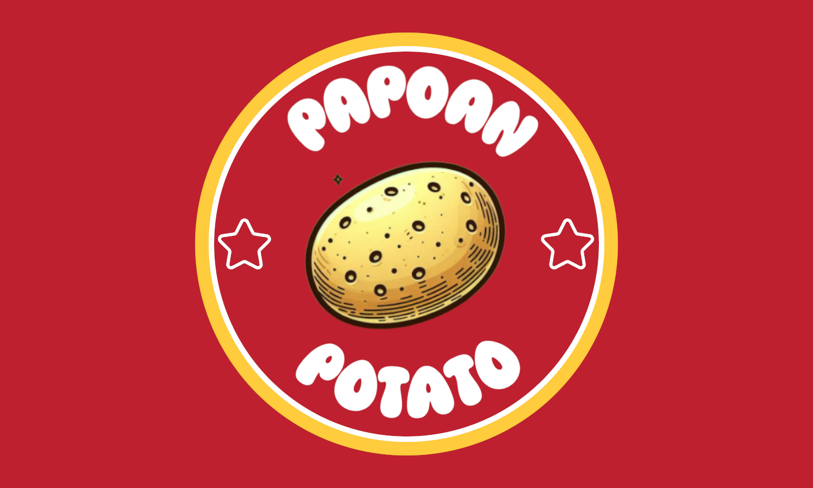

# 🍽️ Proyecto Papoan 🍽️

## 🤔 ¿Que es este proyecto? 🤔

Este es un proyecto de clase de la asignatura **Lenguajes de Marca**. Nosotros nos decantamos por la creación de un restaurante virtual especializado en la gastronomía.

Lo que mas nos hemos decantando ha sido en que la página web fuese **responsive**, lo que nos permitió crear una experiencia de usuario más **agradable** y **atractiva**.

## 🔧 ¿Que hace Papoan? 🔧

**Papoan** mejora la **experiencia** de los usuarios en su interacción con restaurantes. A través de esta plataforma, los usuarios pueden:  

- **🍔 Explorar información detallada sobre los productos disponibles.**
- **🏠 Consultar datos relevantes sobre los restaurantes asociados.**  
- **🥬 Descubrir ingredientes específicos que se encuentran a la venta.**  
- **🔥 Aprovechar promociones exclusivas ofrecidas por los restaurantes.**  
- **🎉 Estar al día con eventos organizados para los clientes.**  

🎯 **Objetivo:** Conectar a los restaurantes con sus clientes de manera más efectiva, proporcionando una experiencia intuitiva, informativa y atractiva.

## 📝 Tecnologías Utilizadas 📝

    

## 👥 Integrantes 👥

- [**Jose Manuel Payán Gordillo**](https://github.com/L3V1XX)
- [**Pablo Plazuelo Jimenez**](https://github.com/Kasi800)
- [**Adrian Marquez Bellido**](https://github.com/justy005)

## 📍 Enlaces 📍

- **[Enlaces del Repositorio 🔗](https://github.com/L3V1XX/Proyecto_PAPOAN)**

- **[Enlace de la página Web🌐](https://proyecto-papoan.pages.dev/)**
